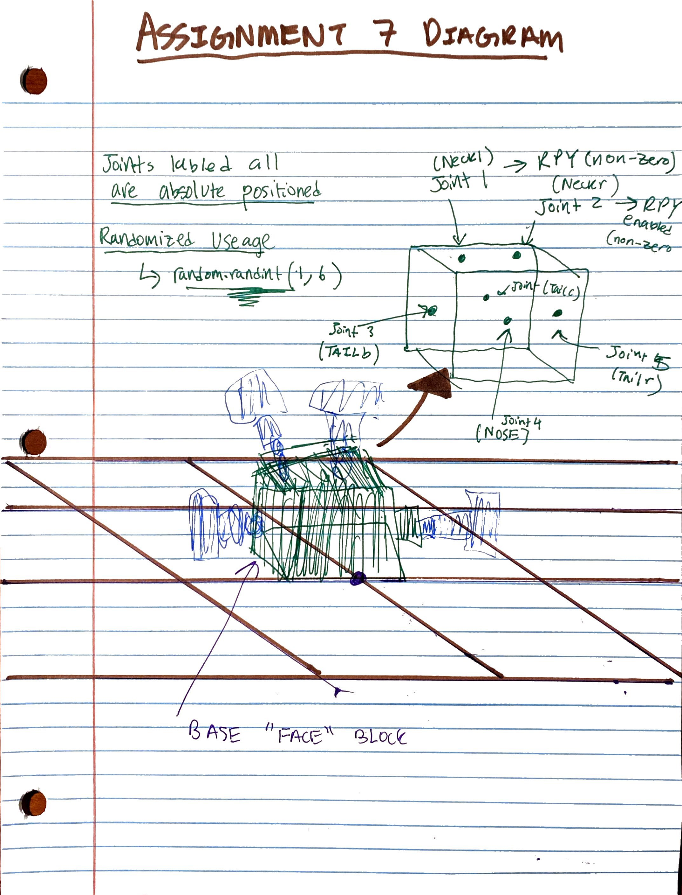

# ludobots - Vikram Achuthan, Artificial Life - CS 396, Northwestern University - Assignment 8 

## Overview:

This week, I created a create a program built on the randomized 3d morphology creatures I built last week, by incorporating movement and locomotion behavior. Parallel Hill Climber (ludobots original: https://www.reddit.com/r/ludobots/wiki/parallelhc/#wiki_mutate)
, a specialized type of local search algorithm that allows the program to improve its movement as generations increase. 

My goal was to create a figure that resembled a creature performing an activity, much like those we saw when studying Karl Sims' work, some of which is listed here: https://www.karlsims.com/evolved-virtual-creatures.html After experimenting with how joints can be manipulated in pyrosim and pybullet, I settled on manipulating the rpy configuration (rpy = "roll pitch yaw") in joints.py, a file that is part of the pyrosim library. The creature I eventually evolved to create was a pig with a long tail and arms, which in future assignments and the final project, I want to enable to smell food and move closer to it. This is why the nose is a defining feature of the creature. Links with and without sensors are colored green and blue, respectively. Sensors are currently only able to sense movement, as they have been throughout the ludobots project, but I hope to build them to sense objects of a specific nature. Note the images below that describe how the joints and links were formed and evolved, and the variation possible with my program. 

## Fitness function and Locomotion details:

The goal of this program was to have the pig creature (and other randomly generated creatures) move in a steady gait away from the origin. I modified the fitness function from the original way we did it in the ludobots course. My modified fitness function used the distance function to calcualte distance traveled, using the x-coordinate position and y-coordinate position (there was no intended upward, z-direction movement for this program). This, in my opinon, is a better fitness function than the original for my larger, more invoved pig creature, since the previous fitness function moved the location of the starting root, and did not use distance traveled appropriately. See the graphic below for more details on how the creature evolved to move further. 

## Other Info:

Randomness is incorporated into the program by utilizing the random() library, which generated a random number of sensor and motor neurons each time the simulation ran. Randomness also exists through the links that develop from the "face" block, including in their direction, size, rpy angle (measured in radians), and length. Random.seed() is a way to define separate trials formally. See more below:

In order to see the randomized simulations, download the code and run the search.py file, once you have pyrosim and pybullet installed. IMPORTANT: The code will run 1 generation, at the starting seed value of 5. For other seeds, the random.seed() value needs to be changed manually in solution.py. Additionally, the file the fitness data is being written to needs to be changed, in the Show_Best() function in parallelHillClimber.py, each time a new seed is run. Note also that the population size and number of generations can be changed in parallelHillClimber.py. 

Citation: https://www.reddit.com/r/ludobots/wiki/finalproject/

